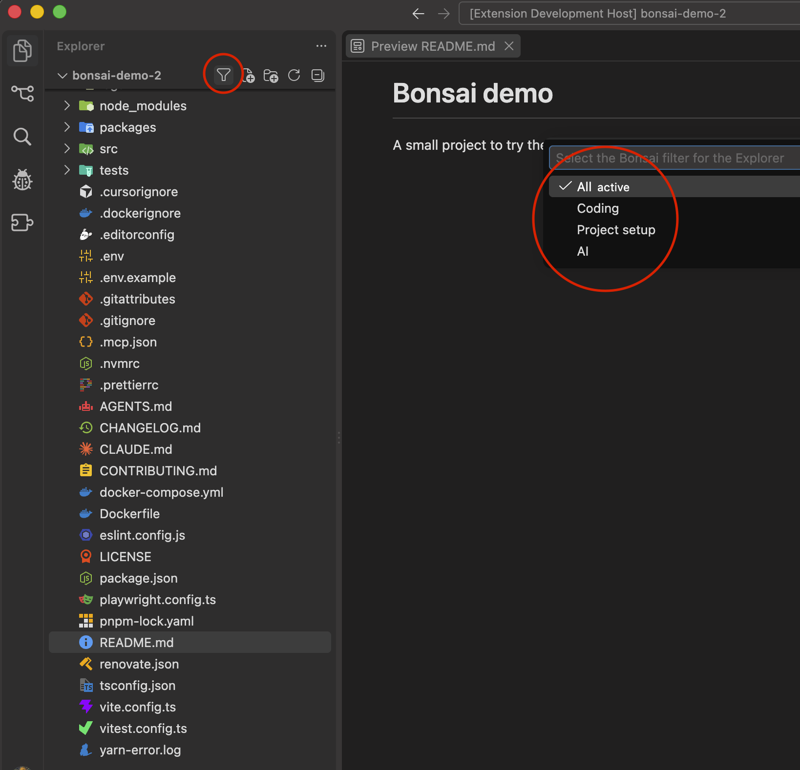
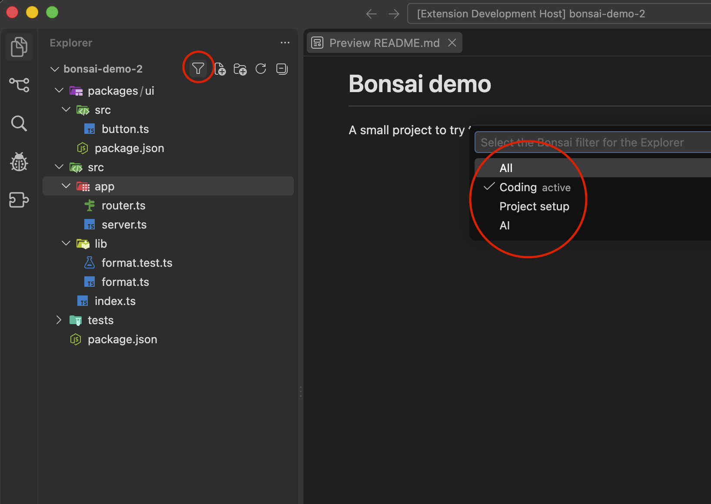

# Bonsai

Bonsai hides the files and folders that your current task does not need. Four filters switch
between views of the same project:

| Filter | What you see |
| --- | --- |
| All | Everything. Bonsai removes every key it generated. |
| Coding | Source code and package manifests. Config files, docs, outputs, caches, logs, and AI files are hidden. |
| Coding excluding tests | The same as Coding, and test folders and test files are hidden too: `__tests__`, `test`, `e2e`, `*.test.*`, `*.spec.*`, and their peers in other languages. |
| Project setup | Only the scaffolding: manifests, lockfiles, compiler, lint, format, test, build, CI, containers, env, Git and editor metadata, docs, release tooling, bots, and AI files. |
| AI | Only the files that AI coding tools read or write, for 22 tools from Claude Code to Copilot. |

Bonsai works through the `files.exclude` setting of each workspace folder, the only lever the
built-in Explorer offers. It writes its own keys next to yours and never touches yours.





## How to use it

- Click the filter icon in the Explorer title bar, or the filter name in the status bar. Both open
  the filter picker.
- Or run a command: `Bonsai: Coding Filter`, `Bonsai: Coding Excluding Tests Filter`,
  `Bonsai: Project Setup Filter`, `Bonsai: AI Filter`, `Bonsai: Show All`, `Bonsai: Cycle Filter`,
  `Bonsai: Select Filter`.
- Bind keys to those commands as you like. Bonsai ships no default keybindings.

Hidden files are hidden from Quick Open and search too, because that is how `files.exclude` works.
An open editor keeps its file visible in the Explorer. VS Code does that on its own.

## Keep the generated keys out of Git

The keys land in `.vscode/settings.json`, which is often committed. Bonsai offers a local Git
clean filter that strips its keys from everything Git reads from the working tree: status, diff,
add, stash, and commit. Nothing tracked changes. Bonsai asks once per repository before it sets
this up, and the setting `bonsai.git.cleanFilter` can answer for you.

The setup writes three things inside the `.git` folder of the repository:

1. One line in `info/attributes` that assigns the filter to the settings file.
2. The `filter.bonsai.clean` command in the local config. It runs a small script with Node.
3. A state file with the list of generated keys, which the script reads.

`Bonsai: Git: Check Clean Filter` reports the state of the setup. `Bonsai: Git: Remove Clean Filter`
removes all three parts. Bonsai repairs a broken setup on every start, for example after a Node
version disappears.

A Git client that does not call the `git` binary bypasses the filter. VS Code, GitHub Desktop, and
lazygit call the binary. JetBrains IDEs can use an embedded Git implementation for some operations.

## Configuration

Bonsai has two building blocks. A **category** is a named set of glob patterns that says what a
file is, for example `lint` or `ci`. A **filter** is what a button activates. A filter has a base
mode and two lists of rules:

- `showAll`: everything is visible. Hide rules run first, show rules run last.
- `hideAll`: everything is hidden. Show rules run first, hide rules run last.

A rule entry is a glob, a `category:<id>` reference, or a `!` removal of either:

```jsonc
// settings.json
"bonsai.categories": {
  // Adds one pattern to the built-in lint category.
  "lint": { "patterns": ["**/.oxlintrc.json"] },
  // A new category that references two built-in ones.
  "infrastructure": { "label": "Infrastructure", "patterns": ["category:ci", "category:containers", "terraform"] }
},
"bonsai.filters": {
  // Keeps lint config visible in the Coding filter, and hides infrastructure.
  "coding": { "hide": ["!category:lint", "category:infrastructure"] },
  // A new filter that starts from Coding and also hides package manifests.
  "coding-strict": { "label": "Coding (strict)", "extends": "coding", "hide": ["category:manifests"] },
  // Removes a built-in filter from the buttons.
  "setup": { "enabled": false }
},
// Folders that Bonsai never opens while it computes a filter.
"bonsai.leafFolders": ["generated", "!dist"]
```

Lists add up across user, workspace, and folder settings, and a removal drops an inherited entry.
Patterns use the VS Code glob dialect: a pattern without a leading `**/` matches only at the
workspace folder root, `**/` matches at any depth, and a pattern that matches a folder applies to
the whole subtree.

| Setting | Default | Purpose |
| --- | --- | --- |
| `bonsai.filters` | `{}` | Filters keyed by id. Extend a built-in one or add your own. |
| `bonsai.categories` | `{}` | Categories keyed by id. Extend a built-in one or add your own. |
| `bonsai.leafFolders` | `[]` | Folder name globs that the walk never opens, on top of the built-in list. |
| `bonsai.coding.hidePackageManifests` | `false` | Hide package manifests in the Coding filter too. |
| `bonsai.git.cleanFilter` | `ask` | `ask`, `always`, or `never` for the Git clean filter. |
| `bonsai.statusBar.enabled` | `true` | Show the active filter in the status bar. |
| `bonsai.maxWalkEntries` | `50000` | The walk budget per workspace folder. |

Built-in category ids: `manifests`, `lockfiles`, `packageManager`, `dependencies`, `compiler`, `lint`, `format`,
`test`, `testCode`, `build`, `bundler`, `monorepo`, `ci`, `containers`, `env`, `versionManagers`, `git`,
`gitHooks`, `editor`, `docs`, `legal`, `release`, `bots`, `output`, `cache`, `coverage`, `logs`,
`osJunk`, `typings`, `storybook`, `migrations`, `apiSchema`, `ai`, plus the composites `config`
and `generated`.

## How it stays fast

The Explorer evaluates glob keys itself, one folder listing at a time, so a glob costs nothing.
Bonsai walks the tree only where a show rule and a hide rule can both match, and it never opens a
leaf folder such as `node_modules`. It caches the last result, so a filter applies at once on start.
The output channel `Bonsai` logs every plan with the number of entries it read.

## Development

```
pnpm install
pnpm run check            # type check and lint
pnpm run test             # unit tests
pnpm run test:integration # runs inside a downloaded VS Code
pnpm run build
pnpm run package
```

The design lives in `docs/architecture.md`.
